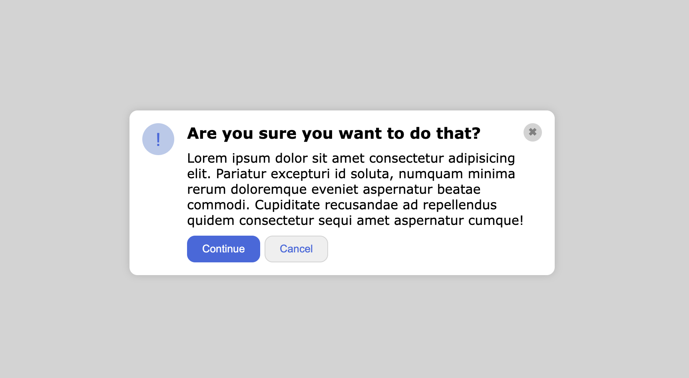

# flex-modal

-Utilisation du terminal pour les commandes de types: crétations de dossier, fichiers etc..

-Utilisation du terminal pour les commandes git.

-Reproduire ce modèle, en utilisant les flex-box:

Résultat:

